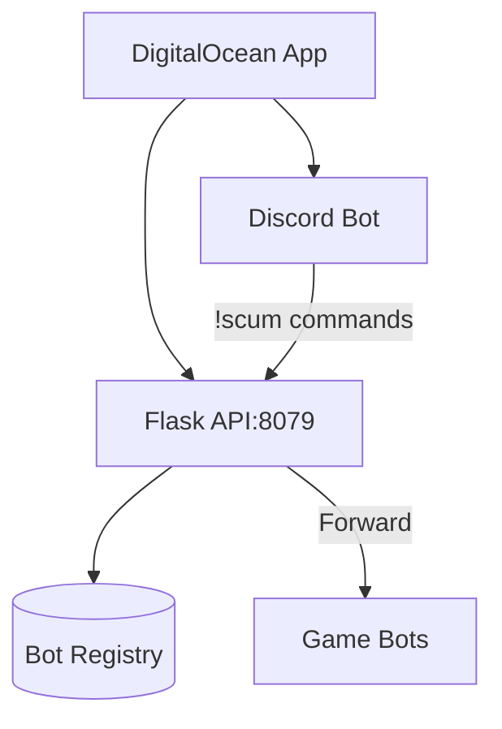

**SCUM Management Bot System - README**  
---

### **Overview**  
A dual-purpose system combining a **Discord bot** and **Flask API** to manage SCUM game bots. Designed for server admins to remotely verify player identities and check bot statuses via Discord commands.

---

### **Key Features**  
#### **Discord Bot**  
- **Admin-Only Commands**:  
  - `!scum <bot_id> verify`: Trigger player verification  
  - `!scum <bot_id> status`: Check bot operational status  
- **Secure Interactions**:  
  - Ephemeral responses for privacy  
  - Role-based access control (`Admin` role required)  
  - 3-second interaction timeout handling  

#### **Flask API**  
- **Bot Registration**:  
  - Endpoint: `POST /bot/register`  
  - Stores bot metadata (ID, callback URL, last seen)  
- **Command Forwarding**:  
  - Endpoint: `POST /bot/command`  
  - Routes commands to registered game bots  
- **Security**:  
  - API key authentication (`X-API-Key` header)  
  - Rate limiting (5/min for registration, 20/min for commands)  
- **Health Monitoring**:  
  - Endpoint: `GET /` returns service status  

---

### **Technical Stack**  
- **Language**: Python 3.10  
- **Core Libraries**:  
  - `discord.py` (v2.4.0) - Bot interactions  
  - `Flask` (v3.1.0) - API server  
  - `Waitress` - Production-grade WSGI server  
- **Infrastructure**:  
  - Docker containerization  
  - DigitalOcean App Platform deployment  

---

### **Environment Variables**  
| Key | Purpose | Example Value |  
|-----|---------|---------------|  
| `DISCORD_TOKEN` | Bot authentication | `MTEzNz...` |  
| `VPS_API_KEY` | Internal API security | `scum_2024_...` |  
| `VPS_API_URL` | API endpoint | `http://localhost:8079` |  

---

### **Setup Guide**  
1. **Discord Configuration**:  
   - Enable intents in [Developer Portal](https://discord.com/developers/applications):  
     - `MESSAGE CONTENT INTENT`  
     - `SERVER MEMBERS INTENT`  

2. **Local Development**:  
   ```bash
   python3 -m venv venv
   source venv/bin/activate
   pip install -r requirements.txt
   ```

3. **Docker Deployment**:  
   ```dockerfile
   # Build
   docker build -t scum-bot . 

   # Run
   docker run -e DISCORD_TOKEN=your_token -p 8079:8079 scum-bot
   ```

---

### **Deployment Architecture**  


---

### **Future Roadmap**  
1. **Enhanced Features**:  
   - `!scum logs` - View recent bot activity  
   - Auto-ban system for failed verifications  
2. **Monitoring**:  
   - Grafana dashboard integration  
   - SMS alerts for critical failures  
3. **Security**:  
   - JWT authentication for API endpoints  
   - IP whitelisting for game bots  

---

### **Troubleshooting**  
- **Health Check Fails**: Verify `GET /` returns `{"status":"healthy"}`  
- **Command Timeouts**: Check API logs for `Timeout` errors  
- **403 Errors**: Validate `X-API-Key` header matches `VPS_API_KEY`  

--- 

**License**: MIT  
**Maintainer**: [SHINWOLF]  
**Support**: [itsmekenesu@gmail.com]  
